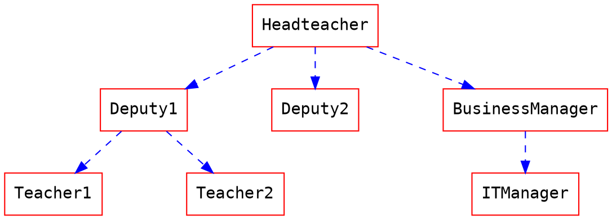
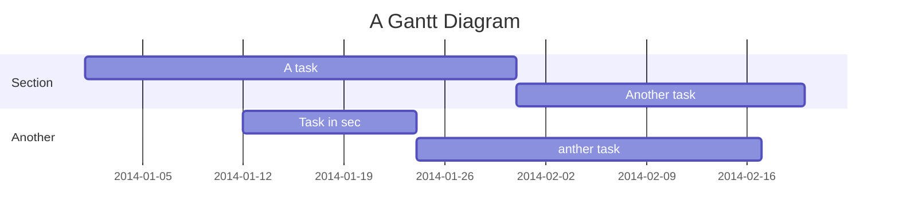
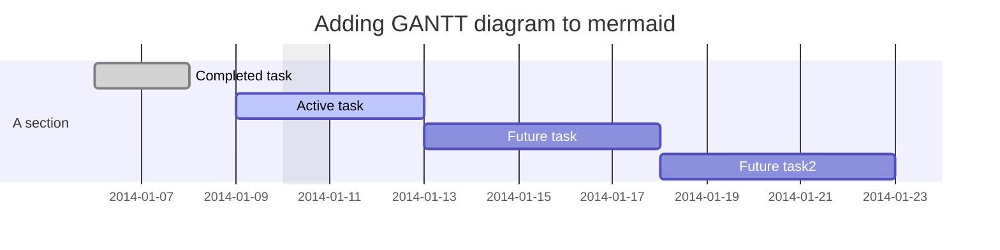
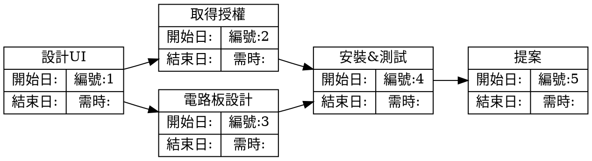

# hankMD 功能大略

## 開會時間
- 1th 2020/09/23 14:00
  - 開會內容:
- 2th > 待約
> 引用1
>> 引用2
>>> 引用3
>>> 
*斜體*
**粗體**



https://hackmd.io/@jiaming412/S1LfKTlBD
```htl
<iframe width="70%" height="900" src="https://hackmd.io/features" frameborder="0"></iframe>
```
[TOC]
### Speakerdeck


### PDF
**注意：請使用 https 的網址，否則可能會被您的瀏覽器阻擋載入**


## UML 圖表

### 循序圖

您可以像是以下使用循序圖：

```sequence
艾莉絲->包柏: 哈摟，你好嗎？
Note right of 包柏: 包柏思考中
包柏-->艾莉絲: 我很好，謝謝！
Note left of 艾莉絲: 艾莉絲回應
艾莉絲->包柏: 最近過得怎樣？
```

### 流程圖

您可以像是以下使用流程圖：
```flow
st=>start: 開始
e=>end: 結束
op=>operation: 我的操作
op2=>operation: 啦啦啦
cond=>condition: 是或否？

st->op->op2->cond
cond(yes)->e
cond(no)->op2
```

### Graphviz


### Mermaid

### Mermaid


### Vega-Lite
```vega
{
  "$schema": "https://vega.github.io/schema/vega-lite/v4.json",
  "data": {"url": "https://vega.github.io/editor/data/barley.json"},
  "mark": "bar",
  "encoding": {
    "x": {"aggregate": "sum", "field": "yield", "type": "quantitative"},
    "y": {"field": "variety", "type": "nominal"},
    "color": {"field": "site", "type": "nominal"}
  }
}
```

警告區塊
---
:::success
耶 :tada:
:::

:::info
這是訊息 :mega:
:::

:::warning
注意 :zap:
:::

:::danger
喔不 :fire:
:::

:::spoiler 點選顯示更多內容
找到我了！ :stuck_out_tongue_winking_eye:
:::

:::spoiler {state="open"} 預設展開摺疊內容
找到我了！ :stuck_out_tongue_winking_eye:
:::

#### 項目

+ 在行開頭使用 `+` `-` 或是 `*` 來建立清單
+ 空兩個空白就可以產生子清單
  - 當清單標記使用的字元不同，會強制建立新的清單
    * Ac tristique libero volutpat at
    + Facilisis in pretium nisl aliquet
    - Nulla volutpat aliquam velit
+ 非常簡單！

#### 編號

1. Lorem ipsum dolor sit amet
2. Consectetur adipiscing elit
3. Integer molestie lorem at massa
1. 您可以逐次增加項目數字...
6. 5454
7. 848

 程式碼:


    // sodkoksd
    484848
    15121
    
    
### 連結
[連結文字](http://dev.nodeca.com)
[加上標題的連結文字](http://nodeca.github.io/pica/demo/ "標題文字！")
自動轉換連結 https://github.com/nodeca/pica


使用指定的大小顯示圖片
    
    
---------
    
# 以下是練習唷~~

## PERT圖




   

